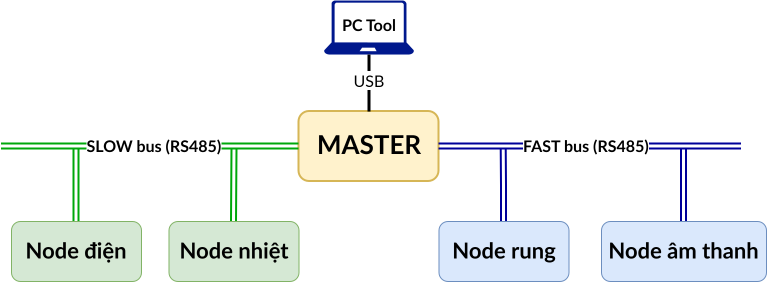

# Hệ thống đo đa thông số cho máy CNC để cung cấp thông tin phát hiện dữ liệu bất thường
## Giới thiệu

Đồ án tốt nghiệp xây dựng hệ thống giám sát đa thông số cho máy CNC nhằm thu thập và truyền dữ liệu thời gian thực, phục vụ giám sát tình trạng máy và làm dữ liệu đầu vào cho các mô hình AI phát hiện sớm bất thường.

Các thông số được giám sát:

- Điện năng tiêu thụ
- Nhiệt độ
- Rung động
- Âm thanh

## Kiến trúc hệ thống

Hệ thống bao gồm:

- 01 node Master
- Các node cảm biến dữ liệu

### Nút đo điện năng

- Cảm biến PZEM-004T

### Nút đo nhiệt độ

- PT100
- MAX31865

### Nút đo rung động

- ADXL345

### Nút đo âm thanh

- ICS43434

Các node giao tiếp với Master thông qua chuẩn RS485 sử dụng cáp RJ45.

Nguồn cấp tập trung 12V cho toàn bộ hệ thống.
## Nguyên lý hoạt động

Hệ thống sử dụng hai tuyến truyền thông:

### SLOW BUS

Thu thập dữ liệu:

- Điện năng
- Nhiệt độ

Ưu tiên độ ổn định và độ tin cậy.

### FAST BUS

Thu thập dữ liệu:

- Rung động
- Âm thanh

Ưu tiên tốc độ truyền dữ liệu cao.

Master thu thập dữ liệu từ cả hai bus và gửi dữ liệu tới máy tính thông qua cổng USB.

Phần mềm Python trên máy tính thực hiện:

- Hiển thị dữ liệu
- Ghi log
- Hỗ trợ phân tích dữ liệu
## Kết quả đạt được

- Xây dựng thành công hệ thống thu thập dữ liệu đa node.
- Thiết kế mạng truyền thông RS485 ổn định.
- Triển khai cơ chế Timeout/Retry.
- Thu thập dữ liệu phục vụ giám sát và phân tích tình trạng máy CNC.
